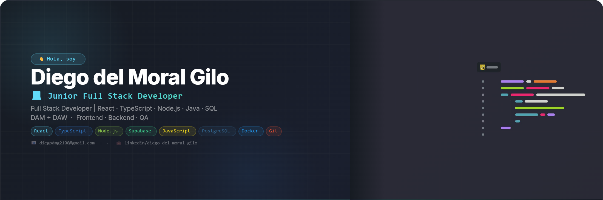

 

# 👋 Hola, soy Diego del Moral Gilo

## 💻 Junior Full Stack Developer

Desarrollador de software especializado en el desarrollo de aplicaciones web y multiplataforma. 
Graduado en **Desarrollo de Aplicaciones Multiplataforma (DAM)** y **Desarrollo de Aplicaciones Web (DAW)**.

Me apasiona crear soluciones digitales eficientes, escalables y orientadas al usuario, combinando buenas prácticas de programación, diseño limpio y tecnologías actuales.

Tengo experiencia trabajando en desarrollo frontend y backend, integración de servicios, bases de datos, pruebas de calidad (QA) y mejora continua de aplicaciones.

Actualmente enfocado en seguir creciendo como desarrollador Full Stack, aprendiendo nuevas tecnologías y participando en proyectos donde pueda aportar valor mediante código y soluciones innovadoras.

---

## 🚀 Proyectos destacados

### 📚 E-Commerce de Libros

Aplicación web completa para la gestión y venta de libros.

**Características principales:**
- Catálogo de productos
- Gestión de usuarios
- Sistema de autenticación
- Carrito de compra
- Gestión de datos
- Diseño responsive
- Integración frontend/backend
- Pasarela de pago con Stripe

**Tecnologías utilizadas:**

React · TypeScript · Node.js · Supabase 

---

## 🛠️ Tecnologías

### Frontend

### Backend

### Bases de datos y servicios

### Herramientas

---

## 📌 Formación

🎓 Desarrollo de Aplicaciones Multiplataforma (DAM)  
🎓 Desarrollo de Aplicaciones Web (DAW)

---

## 📊 GitHub Stats

---

## 📫 Contacto

💼 LinkedIn: www.linkedin.com/in/diego-del-moral-gilo-245ab5380  
📧 Email: diegodmg2108@gmail.com

---

⭐ Siempre aprendiendo, creando y mejorando como desarrollador.
